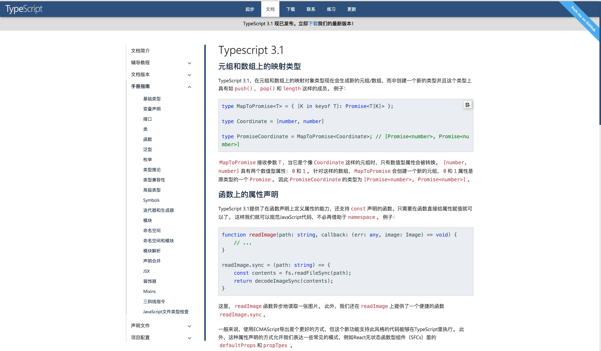

# TS 基础知识

## 资料素材

[](https://www.tslang.cn/docs/handbook/basic-types.html)

## 一起快速过一遍

### 为什么用 TS？

TypeScript 提供了一套静态检测机制, 可以帮助我们在编译时就发现错误。

### 玩一玩

```shell
# ts-node 编译ts，生成js脚本并执行该js脚本，不会生成js脚本文件
npm i -g typescript ts-node

mkdir ts-demo & cd ts-demo

# 创建tsconfig.json文件，后面看一眼包含的属性
tsc --init
```

创建一个.ts 后缀的文件 demo.ts ，添加如下代码

```typescript
let str: string = "gornin";
let num: number = 18;
let bool: boolean = false;
```

执行 `ts-node demo.ts` vs `tsc demo.ts` 查看二条命令的差异

### 数据类型的定义方式

> 基础数据类型是复杂数据类型的基石，组装复杂数据类型的素材

```typescript
let str: string = "gornin";
let num: number = 18;
let bool: boolean = false;
let u: undefined = undefined;
let n: null = null;
let obj: object = { x: 1 };
let big: bigint = 100n; // bigint 与 number 并不兼容，不能互相赋值
let sym: symbol = Symbol("me");
```

#### 联合类型 |

联合类型表示取值可以为多种类型中的一种，使用 | 分隔每个类型

```typescript
let myFavoriteNumber: string | number;
myFavoriteNumber = "seven"; // OK
myFavoriteNumber = 7; // OK
```

#### 交叉类型 &

交叉类型是将多个类型合并为一个类型，包含所需的所有类型的特性<br />交叉类型真正的用武之地就是将多个接口类型合并成一个类型，从而实现等同接口继承的效果，也就是所谓的合并接口类型

```typescript
{
  type Useless = string & number;
}
{
  type IntersectionType = { id: number; name: string } & { age: number };
  const mixed: IntersectionType = {
    id: 1,
    name: "name",
    age: 18,
  };
}
```

> 思考：如果合并的多个接口类型存在同名属性会是什么效果呢？

```typescript
// 如果同名属性的类型不兼容，比如上面示例中两个接口类型同名的 name 属性类型一个是 number，另一个是 string，合并后，name 属性的类型就是 number 和 string 两个原子类型的交叉类型，即 never
{
  type IntersectionTypeConfict = { id: number; name: string } & {
    age: number;
    name: number;
  };
  const mixedConflict: IntersectionTypeConfict = {
    id: 1,
    name: 2, // ts(2322) 错误，'number' 类型不能赋给 'never' 类型
    age: 2,
  };
}
// 如果同名属性的类型兼容，比如一个是 number，另一个是 number 的子类型、数字字面量类型，合并后 name 属性的类型就是两者中的子类型。
{
  type IntersectionTypeConfict = { id: number; name: 2 } & {
    age: number;
    name: number;
  };

  let mixedConflict: IntersectionTypeConfict = {
    id: 1,
    name: 2, // ok
    age: 2,
  };
  mixedConflict = {
    id: 1,
    name: 22, // '22' 类型不能赋给 '2' 类型
    age: 2,
  };
}
// 在混入多个类型时，若存在相同的成员，且成员类型为非基本数据类型，那么是可以成功合并。
{
  interface A {
    x: { d: true };
  }
  interface B {
    x: { e: string };
  }
  interface C {
    x: { f: number };
  }
  type ABC = A & B & C;
  let abc: ABC = {
    x: {
      d: true,
      e: "",
      f: 666,
    },
  };
}
```

#### 定义 Array []

```typescript
let arr: string[] = ["1", "2"];
let arr2: Array<string> = ["1", "2"];
```

#### 定义联合类型数组

```typescript
let arr: (number | string)[]; // 数组每一项可以是number类型或string类型
arr = [1, 2, 3];
arr = ["1", "2", "3"];
arr = [1, "a", 2, "3"];
// arr = [true, {}]
```

#### 定义对象

```typescript
// 接口
interface PersonType {
  name: string;
  age: number;
  married: boolean;
  // ...
}

const person: PersonType = {
  name: "gornin",
  age: 18,
};
```

#### 定义函数 function 及 函数表达式

```typescript
// 参数:数据类型，(参数签名):返回值类型
function getSum(x: number, y: number): number {
  return x + y;
}

// 采用函数表达式接口定义函数的方式时，对等号左侧进行类型限制，可以保证以后对函数名赋值时保证参数个数、参数类型、返回值类型不变。
const getSum: (x: number, y: number) => number = (
  x: number,
  y: number
): number => {
  return x + y;
};
```

#### 接口定义函数类型

```typescript
interface SearchFunc {
  (source: string, subString: string): boolean;
}

const handleSearch: SearchFunc = (
  source: string,
  subString: string
): boolean => {
  return source.includes(subString);
};
```

### interface 接口

约束对象的形状必须和接口一致<br />接口一般首字母大写

#### 可选属性`?` 与 只读属性`readonly`

```typescript
interface Person {
  // 只读属性用于限制只能在对象刚刚创建的时候修改其值
  readonly name: string;
  age?: number;
}
```

ReadonlyArray<T> 类型，它与 Array<T> 相似，只是把所有可变方法去掉了，因此可以确保数组创建后再也不能被修改。

```typescript
let a: number[] = [1, 2, 3, 4];
let ro: ReadonlyArray<number> = a;
ro[0] = 12; // error!
ro.push(5); // error!
ro.length = 100; // error!
a = ro; // error!
```

#### 任意属性 索引签名

```typescript
interface Person {
  name: string;
  age?: number;
  // 一旦定义了任意属性，那么确定属性和可选属性的类型都必须是它的类型的子集
  // 一个接口中只能定义一个任意属性。如果接口中有多个类型的属性，则可以在任意属性中使用联合类型
  [propName: string]: string | number | undefined;
}

let tom: Person = {
  name: "Tom",
  age: 25,
  gender: "male",
};
```

#### 鸭氏辨型法

> 像鸭子一样走路并且嘎嘎叫的就叫鸭子

```typescript
{
  interface LabeledValue {
    label: string;
  }
  function printLabel(labeledObj: LabeledValue) {
    console.log(labeledObj.label);
  }
  // 将对象用另一个变量myObj接收
  let myObj = { size: 10, label: "Size 10 Object" };
  printLabel(myObj); // OK
}
{
  interface LabeledValue {
    label: string;
  }
  function printLabel(labeledObj: LabeledValue) {
    console.log(labeledObj.label);
  }
  // 对象直接给labeledObj赋值
  printLabel({ size: 10, label: "Size 10 Object" }); // Error
}
```

1. 将该对象用另一个变量 myObj 接收，myObj 不会经过额外属性检查，
2. 但会根据类型推论为`let myObj: { size: number; label: string } = { size: 10, label: "Size 10 Object" };`，
3. 然后将这个 myObj 再赋值给 labeledObj，此时根据类型的兼容性，两种类型对象，参照鸭式辨型法，因为都具有 label 属性，所以被认定为两个相同，故而可以用此法来绕开多余的类型检查。

#### 绕开额外属性检查的方式

1. 鸭氏辨型法
2. 类型断言
3. 索引签名

#### interface vs type

1. 接口可以扩展类型别名，类型别名也可以扩展接口。
   - 接口的扩展就是继承，通过 `extends` 来实现
   - 类型别名的扩展就是交叉类型，通过 `&` 来实现
2. 接口可以定义多次，自动合并为单个接口，type 不可以定义多次
3. 都可以用来描述对象或函数类型，type 似赋值，用 `=`，interface 似 `class` 定义
4. type 还可以用于其他类型，基本类型、联合类型、tuple 等

### TS 特性

#### 可选参数 `?:`

```typescript
function buildName(firstName: string, lastName?: string) {
  if (lastName) {
    return firstName + " " + lastName;
  } else {
    return firstName;
  }
}
let tomcat = buildName("Tom", "Jim", "Cat");
let tom = buildName("Tom");
```

#### 参数默认值

与 ES6 特性一致

```typescript
function buildName(firstName: string, lastName: string = "Cat") {
  return firstName + " " + lastName;
}
```

#### 剩余参数

与 ES6 特性一致

```typescript
function push(array: any[], ...items: any[]) {
  items.forEach(function (item) {
    array.push(item);
  });
}
let a = [];
push(a, 1, 2, 3);
```

#### 类型别名

给一个类型起个新名字

```typescript
type Message = string | string[];
let greet = (message: Message) => {};
```

#### 函数重载

> 情景：使用不同类型的参数来调用同一个函数，该函数会根据不同的参数而返回不同的类型的调用结果

```typescript
function add(x, y) {
  return x + y;
}
add(1, 2); // 3
add("1", "2"); //"12"
```

> `noImplicitAny`
> implicitly: 含蓄地; 暗中地; 不明显地; 蕴涵地; 无疑问地; 无保留地; 绝对地;

函数重载或方法重载 是使用相同名称和不同参数数量或类型创建多个方法的一种能力。

```typescript
type Types = number | string;
function add(a: number, b: number): number;
function add(a: string, b: string): string;
function add(a: string, b: number): string;
function add(a: number, b: string): string;
function add(a: Types, b: Types) {
  // 只要有string形式的参数，就返回string值
  if (typeof a === "string" || typeof b === "string") {
    return a.toString() + b.toString();
  }
  return a + b;
}
const result = add("Semlinker", " Kakuqo");
result.split(" ");
```

#### never 永不存在的值的类型

> 具有不可达的终点

```typescript
// 异常
function err(msg: string): never {
  // OK
  throw new Error(msg);
}

// 死循环
function loopForever(): never {
  // OK
  while (true) {}
}
```

细节：

- never 类型同 null 和 undefined 一样，也是任何类型的子类型，也可以赋值给任何类型
- 除 never 类型外，没有类型可以赋值给 never 类型，any 也不可以
- 可以利用 never 类型的特性来实现全面性检查，写出类型绝对安全的代码

```typescript
type Foo = string | number;

function controlFlowAnalysisWithNever(foo: Foo) {
  if (typeof foo === "string") {
    // 这里 foo 被收窄为 string 类型
  } else if (typeof foo === "number") {
    // 这里 foo 被收窄为 number 类型
  } else {
    // 在 else 分支里面，我们把收窄为 never 的 foo 赋值给一个显式声明的 never 变量。如果一切逻辑正确，那么这里应该能够编译通过
    // foo 在这里是 never
    const check: never = foo;
  }
}

// 栗子：后期开发可能改动Foo，添加boolean
// type Foo = string | number | boolean;
// 如果没有修改方法中的else逻辑，会将boolean赋值给never变量，因无法赋值导致编译错误
```

#### any

> 使用 any 类型，可以很容易地编写类型正确但在运行时有问题的代码。如果我们使用 any 类型，就无法使用 TypeScript 提供的大量的保护机制。请记住，any 是魔鬼！尽量不要用 any。

#### unknown 需缩小类型才能使用，更安全，有预防性

> unknown 与 any 的最大区别是：任何类型的值可以赋值给 any，同时 any 类型的值也可以赋值给任何类型。unknown 任何类型的值都可以赋值给它，但它只能赋值给 unknown 和 any

```typescript
let notSure: unknown = 4;
let uncertain: any = notSure; // OK

let notSure: any = 4;
let uncertain: unknown = notSure; // OK

let notSure: unknown = 4;
let uncertain: number = notSure; // Error
```

使用 typeof、类型断言等方式来缩小未知范围

```typescript
function getDogName() {
  let x: unknown;
  return x;
}
const dogName = getDogName();
// 直接使用
const upName = dogName.toLowerCase(); // Error
// typeof
if (typeof dogName === "string") {
  const upName = dogName.toLowerCase(); // OK
}
// 类型断言
const upName = (dogName as string).toLowerCase(); // OK
```

#### Number、String、Boolean、Symbol

从类型兼容性上看，原始类型兼容对应的对象类型，反过来对象类型不兼容对应的原始类型。

```typescript
let num: number = 1;
let Num: Number = Number(1);
Num = num; // ok
num = Num; // ts(2322)报错
```

#### object、Object、{}

> 结论：
> {}、Object 是比 object 更宽泛的类型（least specific）
> {} 和 Object 可以互相代替，用来表示原始类型（null、undefined 除外）和非原始类型；
> object 则表示非原始类型。

- 原始类型：string、boolean、number、bigint、symbol、null 和 undefined。
- object 代表的是所有非原始类型
- Object 代表所有拥有 toString、hasOwnProperty 方法的类型，所以所有原始类型、非原始类型都可以赋给 Object。同样，在严格模式下，null 和 undefined 类型也不能赋给 Object。
- {}空对象类型和大 Object 一样，也是表示原始类型和非原始类型的集合，并且在严格模式下，null 和 undefined 也不能赋给 {}

```typescript
let lowerCaseObject: object;
lowerCaseObject = 1; // ts(2322)
lowerCaseObject = "a"; // ts(2322)
lowerCaseObject = true; // ts(2322)
lowerCaseObject = null; // ts(2322)
lowerCaseObject = undefined; // ts(2322)
lowerCaseObject = {}; // ok

let upperCaseObject: Object;
upperCaseObject = 1; // ok
upperCaseObject = "a"; // ok
upperCaseObject = true; // ok
upperCaseObject = null; // ts(2322)
upperCaseObject = undefined; // ts(2322)
upperCaseObject = {}; // ok

type isLowerCaseObjectExtendsUpperCaseObject = object extends Object
  ? true
  : false; // true
type isUpperCaseObjectExtendsLowerCaseObject = Object extends object
  ? true
  : false; // true
upperCaseObject = lowerCaseObject; // ok
lowerCaseObject = upperCaseObject; // ok

let ObjectLiteral: {};
ObjectLiteral = 1; // ok
ObjectLiteral = "a"; // ok
ObjectLiteral = true; // ok
ObjectLiteral = null; // ts(2322)
ObjectLiteral = undefined; // ts(2322)
ObjectLiteral = {}; // ok
type isLiteralCaseObjectExtendsUpperCaseObject = {} extends Object
  ? true
  : false; // true
type isUpperCaseObjectExtendsLiteralCaseObject = Object extends {}
  ? true
  : false; // true
upperCaseObject = ObjectLiteral;
ObjectLiteral = upperCaseObject;
```

#### 类型推断

基于赋值表达式推断类型的能力<br />TypeScript 会根据上下文环境自动推断出变量的类型，无须我们再写明类型注解

```typescript
{
  let str: string = "this is string"; // 等价
  let num = 1; // 等价
  let bool = true; // 等价
}

{
  const str = "this is string"; // 不等价
  const num = 1; // 不等价
  const bool = true; // 不等价
}
```

#### 类型断言

通过类型断言这种方式可以告诉编译器，“相信我，我知道自己在干什么”。<br />类型断言好比其他语言里的类型转换，但是不进行特殊的数据检查和解构。<br />它没有运行时的影响，只是在编译阶段起作用。

> 静态类型对运行时的逻辑无能为力

```typescript
const arrayNumber: number[] = [1, 2, 3, 4];
// 程序以为会存在找不到值返回undefined的可能，ts此时并未运行出结果，静态编译阶段
const greaterThan2: number = arrayNumber.find((num) => num > 2); // 提示 ts(2322)

// 断言
const greaterThan2: number = arrayNumber.find((num) => num > 2) as number;

// 尖括号 语法
let someValue: any = "this is a string";
let strLength: number = (<string>someValue).length;

// as 语法
let someValue: any = "this is a string";
let strLength: number = (someValue as string).length;
```

#### 非空断言

后缀表达式操作符 `!`可以用于断言操作对象是非 null 和非 undefined 类型

```typescript
{
  let mayNullOrUndefinedOrString: null | undefined | string;
  mayNullOrUndefinedOrString!.toString(); // ok
  mayNullOrUndefinedOrString.toString(); // ts(2531)
}
{
  type NumGenerator = () => number;

  function myFunc(numGenerator: NumGenerator | undefined) {
    // Object is possibly 'undefined'.(2532)
    // Cannot invoke an object which is possibly 'undefined'.(2722)
    const num1 = numGenerator(); // Error
    const num2 = numGenerator!(); //OK
  }
}
```

#### 确定赋值断言

让 TypeScript 编译器知道该属性会被明确地赋值

```typescript
{
  let x: number;
  initialize();

  // Variable 'x' is used before being assigned.(2454)
  console.log(2 * x); // Error
  function initialize() {
    x = 10;
  }
}
{
  let x!: number;
  initialize();
  console.log(2 * x); // Ok

  function initialize() {
    x = 10;
  }
}
```

#### 类型扩宽 type widening

所有通过 let 或 var 定义的变量、函数的形参、对象的非只读属性，如果满足指定了初始值且未显式添加类型注解的条件，那么它们推断出来的类型就是指定的初始值字面量类型拓宽后的类型，这就是字面量类型拓宽。

#### 类型缩小 type narrowing

通过某些操作将变量的类型由一个较为宽泛的集合缩小到相对较小、较明确的集合

```typescript
{
  let func = (anything: any) => {
    if (typeof anything === "string") {
      return anything; // 类型是 string
    } else if (typeof anything === "number") {
      return anything; // 类型是 number
    }
    return null;
  };
}
```

### 泛型

当我用到 id 的时候，你根据我传给你的类型进行推导<br />类型 T，这个 T 是一个抽象类型，只有在调用的时候才确定它的值

```typescript
// 传递类型，继而链式传递给参数类型和返回类型
function identity<T, U>(value: T, message: U): T {
  console.log(message);
  return value;
}

const val = identity<number, string>(88, "发发发");
console.log(val, typeof val);

const vla = identity(66, "顺顺顺");
```

其中 T 代表 Type，在定义泛型时通常用作第一个类型变量名称。但实际上 T 可以用任何有效名称代替。除了 T 之外，以下是常见泛型变量代表的意思：

- K（Key）：表示对象中的键类型；
- V（Value）：表示对象中的值类型；
- E（Element）：表示元素类型。

#### 泛型约束

```typescript
interface Sizeable {
  size: number;
}

function trace<T extends Sizeable>(arg: T): T {
  console.log(arg.size);
  return arg;
}
```

#### typeof

在类型上下文中获取变量或者属性的类型

```typescript
interface Person {
  name: string;
  age: number;
}
const sem: Person = { name: "semlinker", age: 30 };
// 通过 typeof 操作符获取 sem 变量的类型并赋值给 Sem 类型变量
type Sem = typeof sem;
const lolo: Sem = { name: "lolo", age: 5 };
```

#### keyof

获取某种类型的所有键，其返回类型是联合类型

```typescript
type Todo = {
  id: number;
  text: string;
  done: boolean;
};

const todo: Todo = {
  id: 1,
  text: "Learn TypeScript keyof",
  done: false,
};

// 首先定义了 T 类型并使用 extends 关键字约束该类型必须是 object 类型的子类型，
// 然后使用 keyof 操作符获取 T 类型的所有键，其返回类型是联合类型，
// 最后利用 extends 关键字约束 K 类型必须为 keyof T 联合类型的子类型。
function prop<T extends object, K extends keyof T>(obj: T, key: K) {
  return obj[key];
}

const id = prop(todo, "id"); // const id: number
const text = prop(todo, "text"); // const text: string
const done = prop(todo, "done"); // const done: boolean
```

> 用处启示：获取某个对象中指定属性的属性值，期望用户输入的属性是对象上已存在的属性，限制属性名的范围。

#### in

遍历枚举类型

```typescript
type Keys = "a" | "b" | "c";

type Obj = {
  [p in Keys]: number;
};
```

#### infer

在条件类型语句中，可以用 infer 声明一个类型变量并且对它进行使用。

```typescript
type ReturnType<T> = T extends (...args: any[]) => infer R ? R : any;
```

infer R 就是声明一个变量来承载传入函数签名的返回值类型，简单说就是用它取到函数返回值的类型方便之后使用。

#### extends

添加泛型约束，继承某些接口

#### 索引类型

```typescript
// T[K]表示对象T的属性K所表示的类型
// T[K][] 表示变量T取属性K的值的数组
function getValues<T, K extends keyof T>(person: T, keys: K[]): T[K][] {
  return keys.map((key) => person[key]);
}

interface Person {
  name: string;
  age: number;
}

const person: Person = {
  name: "musion",
  age: 35,
};

getValues(person, ["name"]); // ['musion']
getValues(person, ["gender"]); // 报错
```

#### 映射类型

根据旧的类型创建出新的类型, 我们称之为映射类型

```typescript
interface TestInterface {
  name: string;
  age: number;
}
// 把上面定义的接口里面的属性全部变成可选
// 我们可以通过+/-来指定添加还是删除，且只读
type OptionalTestInterface<T> = {
  +readonly [p in keyof T]+?: T[p];
};

type newTestInterface = OptionalTestInterface<TestInterface>;
// type newTestInterface = {
//    readonly name?:string,
//    readonly age?:number
// }
```

### 内置工具类型

#### Partial

```typescript
// Partial<T> 将类型的属性变成可选
type Partial<T> = {
  [P in keyof T]?: T[P];
};
```

通过 keyof T 拿到 T 的所有属性名，然后使用 in 进行遍历，将值赋给 P，最后通过 T[P] 取得相应的属性值的类型。中间的 ? 号，用于将所有属性变为可选。

> 局限：只支持处理第一层

```typescript
type DeepPartial<T> = {
  // 如果是 object，则递归类型
  [U in keyof T]?: T[U] extends object ? DeepPartial<T[U]> : T[U];
};

type PartialedType = DeepPartial<T>; // 现在T上所有属性都变成了可选啦
```

#### Required

```typescript
// 将类型的属性变成必选
type Required<T> = {
  // -? 是代表移除 ? 这个 modifier 的标识
  [P in keyof T]-?: T[P];
};
```

#### Readonly

```typescript
// Readonly<T> 的作用是将某个类型所有属性变为只读属性，也就意味着这些属性不能被重新赋值。
type Readonly<T> = {
  readonly [P in keyof T]: T[P];
};
```

#### Pick

```typescript
// Pick 从某个类型T中挑出一些属性K出来
type Pick<T, K extends keyof T> = {
  [P in K]: T[P];
};
```

```typescript
interface Todos {
  title: string;
  description: string;
  completed: boolean;
}

type TodoPreview = Pick<Todos, "title" | "completed">;

const todos: TodoPreview = {
  title: "Clean room",
  completed: false,
};
```

#### Record

```typescript
// Record<K extends keyof any, T> 的作用是将 K 中所有的属性的值转化为 T 类型
type Record<K extends keyof any, T> = {
  [P in K]: T;
};

interface Itype {
  [key: string]: number;
}
```

#### ReturnType

```typescript
type ReturnType<T extends (...args: any[]) => any> = T extends (
  ...args: any[]
) => infer R
  ? R
  : any;
```

infer 在这里用于提取函数类型的返回值类型。ReturnType<T> 只是将 infer R 从参数位置移动到返回值位置，因此此时 R 即是表示待推断的返回值类型。

```typescript
// ReturnType获取到 Func 的返回值类型为 string，所以，foo 也就只能被赋值为字符串了。
type Func = (value: number) => string;
const foo: ReturnType<Func> = "1";
```

#### Exclude

```typescript
// 如果 T 能赋值给 U 类型的话，那么就会返回 never 类型，否则返回 T 类型。
// 将 T 中某些属于 U 的类型移除掉
type Exclude<T, U> = T extends U ? never : T;
```

```typescript
type T0 = Exclude<"a" | "b" | "c", "a">; // "b" | "c"
type T1 = Exclude<"a" | "b" | "c", "a" | "b">; // "c"
type T2 = Exclude<string | number | (() => void), Function>; // string | number
```

#### Extract

```typescript
// 从 T 中提取出 U，我理解是取交集类型
type Extract<T, U> = T extends U ? T : never;
```

```typescript
type T0 = Extract<"a" | "b" | "c", "a" | "f">; // "a"
type T1 = Extract<string | number | (() => void), Function>; // () =>void
```

#### Omit

```typescript
// 使用 T 类型中除了 K 类型的所有属性，来构造一个新的类型
// 从 keyof T 中移除K
// 从T中挑出处理后的keyof T
type Omit<T, K extends keyof any> = Pick<T, Exclude<keyof T, K>>;
```

```typescript
interface Todo {
  title: string;
  description: string;
  completed: boolean;
}

type TodoPreview = Omit<Todo, "description">;
const todo: TodoPreview = {
  title: "Clean room",
  completed: false,
};
```

#### NonNullable

```typescript
// 用来过滤类型中的 null 及 undefined 类型
type NonNullable<T> = T extendsnull | undefined ? never : T;
```

```typescript
type T0 = NonNullable<string | number | undefined>; // string | number
type T1 = NonNullable<string[] | null | undefined>; // string[]
```

#### Parameters

```typescript
// 用于获得函数的参数类型组成的元组类型
type Parameters<T extends (...args: any) => any> = T extends (
  ...args: infer P
) => any
  ? P
  : never;
```

```typescript
type A = Parameters<() => void>; // []
type B = Parameters<typeofArray.isArray>; // [any]
type C = Parameters<typeofparseInt>; // [string, (number | undefined)?]
type D = Parameters<typeofMath.max>; // number[]
```

### tsconfig.json

tsconfig.json 是 TypeScript 项目的配置文件。<br />如果一个目录下存在一个 tsconfig.json 文件，那么往往意味着这个目录就是 TypeScript 项目的根目录。

#### tsconfig.json 重要字段

- `files` - 设置要编译的文件的名称；
- `include` - 设置需要进行编译的文件，支持路径模式匹配；
- `exclude` - 设置无需进行编译的文件，支持路径模式匹配；
- `compilerOptions` - 设置与编译流程相关的选项。

#### compilerOptions 选项

```typescript
{
  "compilerOptions": {
    /* 基本选项 */
    "target": "es5", // 指定 ECMAScript 目标版本: 'ES3' (default), 'ES5', 'ES6'/'ES2015', 'ES2016', 'ES2017', or 'ESNEXT'
    "module": "commonjs", // 指定使用模块: 'commonjs', 'amd', 'system', 'umd' or 'es2015'
    "lib": [], // 指定要包含在编译中的库文件
    "allowJs": true, // 允许编译 javascript 文件
    "checkJs": true, // 报告 javascript 文件中的错误
    "jsx": "preserve", // 指定 jsx 代码的生成: 'preserve', 'react-native', or 'react'
    "declaration": true, // 生成相应的 '.d.ts' 文件
    "sourceMap": true, // 生成相应的 '.map' 文件
    "outFile": "./", // 将输出文件合并为一个文件
    "outDir": "./", // 指定输出目录
    "rootDir": "./", // 用来控制输出目录结构 --outDir.
    "removeComments": true, // 删除编译后的所有的注释
    "noEmit": true, // 不生成输出文件
    "importHelpers": true, // 从 tslib 导入辅助工具函数
    "isolatedModules": true, // 将每个文件做为单独的模块 （与 'ts.transpileModule' 类似）.

    /* 严格的类型检查选项 */
    "strict": true, // 启用所有严格类型检查选项
    "noImplicitAny": true, // 在表达式和声明上有隐含的 any类型时报错
    "strictNullChecks": true, // 启用严格的 null 检查
    "noImplicitThis": true, // 当 this 表达式值为 any 类型的时候，生成一个错误
    "alwaysStrict": true, // 以严格模式检查每个模块，并在每个文件里加入 'use strict'

    /* 额外的检查 */
    "noUnusedLocals": true, // 有未使用的变量时，抛出错误
    "noUnusedParameters": true, // 有未使用的参数时，抛出错误
    "noImplicitReturns": true, // 并不是所有函数里的代码都有返回值时，抛出错误
    "noFallthroughCasesInSwitch": true, // 报告 switch 语句的 fallthrough 错误。（即，不允许 switch 的 case 语句贯穿）

    /* 模块解析选项 */
    "moduleResolution": "node", // 选择模块解析策略： 'node' (Node.js) or 'classic' (TypeScript pre-1.6)
    "baseUrl": "./", // 用于解析非相对模块名称的基目录
    "paths": {}, // 模块名到基于 baseUrl 的路径映射的列表
    "rootDirs": [], // 根文件夹列表，其组合内容表示项目运行时的结构内容
    "typeRoots": [], // 包含类型声明的文件列表
    "types": [], // 需要包含的类型声明文件名列表
    "allowSyntheticDefaultImports": true, // 允许从没有设置默认导出的模块中默认导入。

    /* Source Map Options */
    "sourceRoot": "./", // 指定调试器应该找到 TypeScript 文件而不是源文件的位置
    "mapRoot": "./", // 指定调试器应该找到映射文件而不是生成文件的位置
    "inlineSourceMap": true, // 生成单个 soucemaps 文件，而不是将 sourcemaps 生成不同的文件
    "inlineSources": true, // 将代码与 sourcemaps 生成到一个文件中，要求同时设置了 --inlineSourceMap 或 --sourceMap 属性

    /* 其他选项 */
    "experimentalDecorators": true, // 启用装饰器
    "emitDecoratorMetadata": true // 为装饰器提供元数据的支持
  }
}
```

## 编写 ts 代码建议

### 减少重复代码

#### 善用 extends 继承

```typescript
interface Person {
  firstName: string;
  lastName: string;
}

interface PersonWithBirthDate extends Person {
  birth: Date;
}
```

#### 交叉运算符 &

```typescript
type PersonWithBirthDate = Person & { birth: Date };
```

#### 使用 typeof 操作符来快速获取配置对象的「形状」

```typescript
const INIT_OPTIONS = {
  width: 640,
  height: 480,
  color: "#00FF00",
  label: "VGA",
};
type Options = typeof INIT_OPTIONS;
/*
type Options = {
  width: number;
  height: number;
  color: string;
  label: string;
}
*/
```

#### 提取统一的类型签名

```typescript
function get(url: string, opts: Options): Promise<Response> {
  /* ... */
}
function post(url: string, opts: Options): Promise<Response> {
  /* ... */
}

// 改进后
type HTTPFunction = (url: string, opts: Options) => Promise<Response>;
const get: HTTPFunction = (url, opts) => {
  /* ... */
};
const post: HTTPFunction = (url, opts) => {
  /* ... */
};
```

### 使用更精确的类型替代字符串类型

有时使用 string 等类型太宽泛，如果确切知道类型种类，可以使用联合类型加以精准限制；<br />日期类型可以使用 `Date`

### 定义的类型总是表示有效的状态

通过使用可辨识联合类型，让请求的每种状态都是有效的状态，不会出现无效状态的问题。

```typescript
interface RequestPending {
  state: "pending";
}

interface RequestError {
  state: "error";
  errorMsg: string;
}

interface RequestSuccess {
  state: "ok";
  pageContent: string;
}

type RequestState = RequestPending | RequestError | RequestSuccess;

interface State {
  currentPage: string;
  requests: { [page: string]: RequestState };
}
```

## 实战代码片段

### 引入 React

```typescript
// 推荐，最可靠方式
import * as React from "react";
import * as ReactDOM from "react-dom";

// 需要添加额外的配置："allowSyntheticDefaultImports": true
import React from "react";
import ReactDOM from "react-dom";
```

### 函数式组件声明

```typescript
import { FC } from "react";

type AppProps = {
  message: string;
};

const App: FC<AppProps> = ({ message, children }) => (
  <div>
    {message}
    {children}
  </div>
);
```

#### propsWithChildren

```typescript
type AppProps = React.PropsWithChildren<{ message: string }>;
const App = ({ message, children }: AppProps) => (
  <div>
    {message}
    {children}
  </div>
);
```

#### 直接声明

```typescript
type AppProps = {
  message: string;
  children?: React.ReactNode;
};

const App = ({ message, children }: AppProps) => (
  <div>
    {message}
    {children}
  </div>
);
```

### Hooks

#### useState<T>

```typescript
// `val`会推导为boolean类型， toggle接收boolean类型参数
const [val, toggle] = React.useState(false);

// obj会自动推导为类型: {name: string}
const [obj] = React.useState({ name: "sj" });

// arr会自动推导为类型: string[]
const [arr] = React.useState(["One", "Two"]);

type User = {
  name: string;
  age: number;
};
const [user, setUser] = React.useState<User | null>(null); // 显式地声明null类型
```

#### useRef<T>

```typescript
// 第一种方式的 ref1.current 是只读的（read-only），并且可以传递给内置的 ref 属性，绑定 DOM 元素 ；
const ref1 = React.useRef<HTMLInputElement>(null);

// 第二种方式的 ref2.current 是可变的（类似于声明类的成员变量）
const ref2 = React.useRef<HTMLInputElement | null>(null);
// 方式二 栗子：
const ref = React.useRef(0);
React.useEffect(() => {
  ref.current += 1;
}, []);

// 这两种方式在使用时，都需要对类型进行检查
const onButtonClick = () => {
  ref1.current?.focus();
  ref2.current?.focus();
};
```

#### useMemo<T> & useCallback<T>

useMemo 的泛型指定了返回值类型，useCallback 的泛型指定了参数类型

```typescript
// 也可以显式的指定返回值类型，返回值不一致会报错
const result = React.useMemo<string>(() => 2, []);

// 类型“() => number”的参数不能赋给类型“() => string”的参数。
const handleChange = React.useCallback<
  React.ChangeEventHandler<HTMLInputElement>
>((evt) => {
  console.log(evt.target.value);
}, []);
```

#### 使用 Type 还是 Interface？

有几种常用规则：

- 在定义公共 API 时(比如编辑一个库）使用 interface，这样可以方便使用者继承接口
- 在定义组件属性（Props）和状态（State）时，建议使用 type，因为 type 的约束性更强

interface 和 type 在 ts 中是两个不同的概念，但在 React 大部分使用的 case 中，interface 和 type 可以达到相同的功能效果，type 和 interface 最大的区别是：

- type 类型不能二次编辑，而 interface 可以随时扩展

#### 获取未导出的 Type

某些场景下我们在引入第三方的库时会发现想要使用的组件并没有导出我们需要的组件参数类型或者返回值类型，这时候我们可以通过 ComponentProps/ ReturnType 来获取到想要的类型。

```typescript
// 获取参数类型
import { Button } from "library"; // 但是未导出props type
type ButtonProps = React.ComponentProps<typeof Button>; // 获取props
type AlertButtonProps = Omit<ButtonProps, "onClick">; // 去除onClick
const AlertButton: React.FC<AlertButtonProps> = (props) => (
  <Button onClick={() => alert("hello")} {...props} />
);
```

```typescript
// 获取返回值类型
function foo() {
  return { baz: 1 };
}
type FooReturn = ReturnType<typeof foo>; // { baz: number }
```

#### Props

通常我们使用 type 来定义 Props，为了提高可维护性和代码可读性，在日常的开发过程中我们希望可以添加清晰的注释。<br />增加相对详细的注释，使用时会更清晰，需要注意，注释需要使用 /\*\*/ ， // 无法被 vscode 识别

```typescript
/**
 * @param color color
 * @param children children
 * @param onClick onClick
 */

type Props = {
  /** color */
  color?: string;
  /** children */
  children: React.ReactNode;
  /** onClick */
  onClick: () => void;
};
```

#### 基础属性类型

```typescript
type AppProps = {
  message: string;
  count: number;
  disabled: boolean;
  /** array of a type! */
  names: string[];
  /** string literals to specify exact string values, with a union type to join them together */
  status: "waiting" | "success";
  /** 任意需要使用其属性的对象（不推荐使用，但是作为占位很有用） */
  obj: object;
  /** 作用和`object`几乎一样，和 `Object`完全一样 */
  obj2: {};
  /** 列出对象全部数量的属性 （推荐使用） */
  obj3: {
    id: string;
    title: string;
  };
  /** array of objects! (common) */
  objArr: {
    id: string;
    title: string;
  }[];
  /** 任意数量属性的字典，具有相同类型*/
  dict1: {
    [key: string]: MyTypeHere;
  };
  /** 作用和dict1完全相同 */
  dict2: Record<string, MyTypeHere>;
  /** 任意完全不会调用的函数 */
  onSomething: Function;
  /** 没有参数&返回值的函数 */
  onClick: () => void;
  /** 携带参数的函数 */
  onChange: (id: number) => void;
  /** 携带点击事件的函数 */
  onClick(event: React.MouseEvent<HTMLButtonElement>): void;
  /** 可选的属性 */
  optional?: OptionalType;
};
```

#### 常用 React 属性类型

```typescript
export declare interface AppBetterProps {
  children: React.ReactNode; // 一般情况下推荐使用，支持所有类型 Great
  functionChildren: (name: string) => React.ReactNode;
  style?: React.CSSProperties; // 传递style对象
  onChange?: React.FormEventHandler<HTMLInputElement>;
}

export declare interface AppProps {
  children1: JSX.Element; // 差, 不支持数组
  children2: JSX.Element | JSX.Element[]; // 一般, 不支持字符串
  children3: React.ReactChildren; // 忽略命名，不是一个合适的类型，工具类类型
  children4: React.ReactChild[]; // 很好
  children: React.ReactNode; // 最佳，支持所有类型 推荐使用
  functionChildren: (name: string) => React.ReactNode; // recommended function as a child render prop type
  style?: React.CSSProperties; // 传递style对象
  onChange?: React.FormEventHandler<HTMLInputElement>; // 表单事件, 泛型参数是event.target的类型
}
```

#### Form & Events

onChange

```typescript
import * as React from "react";
// 第一种方法使用推断的方法签名（例如：React.FormEvent <HTMLInputElement> ：void）
type changeFn = (e: React.FormEvent<HTMLInputElement>) => void;

const App: React.FC = () => {
  const [state, setState] = React.useState("");

  const onChange: changeFn = (e) => {
    setState(e.currentTarget.value);
  };

  return (
    <div>
      <input type="text" value={state} onChange={onChange} />
    </div>
  );
};
```

```typescript
import * as React from "react";
// '@types/react' 提供的委托类型

const App: React.FC = () => {
  const [state, setState] = React.useState("");

  const onChange: React.ChangeEventHandler<HTMLInputElement> = (e) => {
    setState(e.currentTarget.value);
  };

  return (
    <div>
      <input type="text" value={state} onChange={onChange} />
    </div>
  );
};
```

onSubmit

```typescript
import * as React from "react";

const App: React.FC = () => {
  const onSubmit = (e: React.SyntheticEvent) => {
    e.preventDefault();
    const target = e.target as typeof e.target & {
      password: { value: string };
    }; // 类型扩展
    const password = target.password.value;
  };

  return (
    <form onSubmit={onSubmit}>
      <div>
        <label>
          Password:
          <input type="password" name="password" />
        </label>
      </div>
      <div>
        <input type="submit" value="Log in" />
      </div>
    </form>
  );
};
```

#### Event

React 的声明文件提供了 Event 对象的类型声明。

- ClipboardEvent<T = Element> 剪切板事件对象
- DragEvent<T =Element> 拖拽事件对象
- ChangeEvent<T = Element> Change 事件对象
- KeyboardEvent<T = Element> 键盘事件对象
- MouseEvent<T = Element> 鼠标事件对象
- TouchEvent<T = Element> 触摸事件对象
- WheelEvent<T = Element> 滚轮时间对象
- AnimationEvent<T = Element> 动画事件对象
- TransitionEvent<T = Element> 过渡事件对象

#### Promise 类型

Promise<T> 是一个泛型类型，T 泛型变量用于确定 then 方法时接收的第一个回调函数的参数类型。

```typescript
// 通过 T 泛型变量来确定 result 的类型
type IResponse<T> = {
  message: string;
  data: T;
  success: boolean;
};
type ItemType = {
  name: string;
  age: number;
};
async function getResponse(): Promise<IResponse<ItemType[]>> {
  return {
    message: "获取成功",
    data: [
      { name: "jack", age: 18 },
      { name: "rose", age: 16 },
    ],
    success: true,
  };
}

getResponse().then((response) => {
  console.log(response.result);
});
```

# Umi + TS

## 项目介绍

详见项目`README.md`

## 项目代码展示

支持 [New JSX Transform](https://reactjs.org/blog/2020/09/22/introducing-the-new-jsx-transform.html)，开启该能力之后，编写 React 组件时不再需要在头部引入 React。<br />只需要修改 tsconfig.json 中的 compilerOptions.jsx 即可

```typescript
{
  "compilerOptions": {
-    "jsx": "react",
+    "jsx": "react-jsx",
  }
}
```

### services

```typescript
import type { IResp, IndustryData } from "@/types";

export const getIndustries = (): Promise<IResp<IndustryData[]>> =>
  get("/api/getIndustries");
```

```typescript
export type IResp<T> = {
  code: number;
  msg: string;
  data: T;
};

export interface IndustryData {
  id: string;
  name: string;
  classId: string;
  className: string;
  comments: string;
  children: IndustryData[];
  industryType: string;
  fatherId?: string | null;
  bclassId: string;
  bclassName: string;
  mclassId: string;
  mclassName: string;
}
```

### models

```typescript
import type { ChainStateType, ChainModelType } from "@/types";

const initialState: ChainStateType = {
  // ... 初始值
};

const ChainModel: ChainModelType = {
  namespace: "chain",
  state: initialState,
  effects: {},
  reducers: {},
};
export default ChainModel;
```

```typescript
import type { Effect, Reducer, Subscription, Dispatch } from "umi";

export interface ChainStateType {
  isInit?: boolean;
  areaList?: RegionData[];
  // ...
}

export interface ChainModelType {
  namespace: "chain";
  state: ChainStateType;
  effects: {
    queryIndustries: Effect;
    queryRegions: Effect;
    queryData: Effect;
    getMoreChainData: Effect;
    changeChainData: Effect;
    removeChainData: Effect;
  };
  reducers: {
    update: Reducer<ChainStateType>;
    // 启用 immer 之后
    // save: ImmerReducer<ChainState>;
  };
  subscriptions?: { setup: Subscription };
}
```

### page component

```typescript
import type { FC } from "react";
import type { StoreType, Loading } from "@/types";

const IndustryChain: FC<StoreType> = ({ dispatch, loading, chain }) => {
  // ...
};

export default connect(
  ({
    loading,
    dispatch,
    chain,
  }: {
    dispatch: Dispatch;
    loading: Loading;
    chain: ChainStateType;
  }) => ({ loading, dispatch, chain })
)(IndustryChain);
```

```typescript
import type { Loading, Dispatch } from "umi";

export interface StoreType {
  dispatch: Dispatch;
  loading: Loading;
  chain: ChainStateType;
}
```

# AntV/G6

examples<br />api

[g6-apis.json](https://www.yuque.com/attachments/yuque/0/2022/json/300273/1648782118604-f8225b29-7ba5-4e93-a907-94505fcdae19.json?_lake_card=%7B%22src%22%3A%22https%3A%2F%2Fwww.yuque.com%2Fattachments%2Fyuque%2F0%2F2022%2Fjson%2F300273%2F1648782118604-f8225b29-7ba5-4e93-a907-94505fcdae19.json%22%2C%22name%22%3A%22g6-apis.json%22%2C%22size%22%3A113092%2C%22type%22%3A%22application%2Fjson%22%2C%22ext%22%3A%22json%22%2C%22source%22%3A%22%22%2C%22status%22%3A%22done%22%2C%22mode%22%3A%22title%22%2C%22download%22%3Atrue%2C%22taskId%22%3A%22u276b5a4a-eec8-497d-8634-747b3c2b941%22%2C%22taskType%22%3A%22upload%22%2C%22id%22%3A%22u5623aefc%22%2C%22card%22%3A%22file%22%7D)
